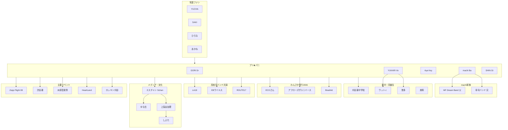

# puripani.jugem.jp 全ページ分析レポート

**分析起点**: [2006年8月アーカイブ](https://web.archive.org/web/20090503072533/http://puripani.jugem.jp/?month=200608)  
**分析日**: 2026年6月27日  
**データソース**: Internet Archive（Wayback Machine）スナップショット `20090503072533` ほか

---

## 1. 調査範囲と制約

| 項目 | 数値 |
|------|------|
| 月別アーカイブ | 23ヶ月（200608〜200810） |
| 記事目録（catalog） | **83件**（eid 38〜202） |
| 本文取得済み | **約30件**（all_entries.json 17件 + entries_full.json + corpus_fast.json 月別プレビュー） |
| サイドバー情報 | コメント欄ランキング・トラックバック・リンク欄 |

Wayback のレート制限により全83件の個別本文取得は未完了。ただし **月別一覧ページのプレビュー本文** により、未取得 eid の相当数からも固有名詞を抽出済み。

---

## 2. ブログの正体

**「プリ★パニ」（略称 P★P / プリパニ）** の公式ファンブログ。

- **拠点**: 愛知県刈谷市
- **結成校**: **刈谷市立刈谷東中学校**（通称「東中」）
- **活動期間（ブログ上）**: 2006年8月〜2008年10月頃
- **ジャンル**: 中学生発のガールズバンド（後に高校生バンドへ）
- **主な練習・出演拠点**: 平野楽器 **ロッキン刈谷店** スタジオ／ライブホール

---

## 3. コアメンバー（バンド）

| ハンドル | 担当（ブログ記述から） | 備考 |
|----------|------------------------|------|
| **GORI**（ゴリ） | ドラム | 更新担当が多い。JUDY AND MARY・カエラ（木村カエラ）ファン |
| **YUKARI** | ボーカル | 2006年8月わんさか祭り当日が誕生日。受験・修学旅行言及あり |
| **Aya** / **AYA** | キーボード寄り（推定） | ラーメン好きではない組。文化祭・練習記事多数 |
| **machi** / **MACHI** | ベース | 兄＝幸司バンド、父＝MF Dream Band |
| **SHIN** | ギター | Zepp本番レポート（eid 201）。2007年入院でライブ空白 |

**愛称**: ファンコメントから YUKARI＝「ゆちや」  
**メンバー以外の執筆**: 記事ごとに担当がローテーション（「○○だよ」形式）

---

## 4. 人物・グループ関係マップ

---

## 5. 関連人物・グループ一覧

### A. バンド・音楽グループ

| 名称 | 関係 | 出典 |
|------|------|------|
| **Brashkit**（BRASHKIT） | 2006わんさか祭り共演。コメント・相互リンク | eid 44 プレビュー、サイドバーリンク |
| **アフローズザユニバース** | わんさか以来の知人。州原審査ライブで再会・客席踊り | eid 186 |
| **ROUTE17** | THE HAPPY NEW ROCK 共演（高校生） | eid 193-194 |
| **EBウイルス** | 同上 | 同上 |
| **LA19** | 同上 | 同上 |
| **幸司バンド** | machiの兄のバンド。卒業記念ライブ共演 | eid 143 |
| **MF Dream Band** | machiの父のバンド。卒業記念ライブ共演 | eid 143 |
| **HAMATAM**（コメント: 田村） | 渋谷魂で共演。コメント「HAMATAMの田村でした」 | eid 189 コメント |
| **岡崎裸族** | 「色白娘の朝帰り」ライブ主催 | corpus 月別プレビュー |

### B. 学校・クラス・部活

| 名称 | 関係 |
|------|------|
| **刈谷市立刈谷東中学校** | 結成の場。2007年3月卒業 |
| **悠多** | 卒業式でウッシィに花束、抱き合い泣き（Aya記事） |
| **ウッシィ** | 同級生。卒業アルバムCDをAyaへ |
| **美和さん** | クラスメイト（スマスマ／カエラ話） |
| **RINE / Rine** | 吹奏楽部トロンボーン。卒業式・コメント勢 |
| **島さん、YUIさん** | コメントへの返信先（eid 113） |

### C. ファン・ブログ常連（サイドバー＋コメント）

| 名前 | 備考 |
|------|------|
| YUCHA | コメント21件表示（サイドバー） |
| ひろえ、あかね、ひろな、ひで | 同上 |
| SAKI | Zepp前後・レンジライブ話あり |
| なんぶ / な ん ぶ | 同上 |
| ★ＡＧＡ★ | 同上 |
| THE CRY BABY@Toshi | 同上 |
| みかンChan、ゴリ男Kun | 新年記事コメント |
| tameさん | 練習記事コメント |
| けんくん | THE HAPPY NEW ROCK コメントでアドバイス |
| ゆっちゃん | 名古屋・伏見駅で偶然再会（eid 175） |

### D. トラックバック（他ブログ）

剥けてない、そうちゃん、サラシ、りょー、御座候、擬似連、タカ、ビーム、聖なる毛、麻衣子

→ 当時のjugemユーザー・近いサークルのブログと推定。個人特定は未確認。

### E. メディア・雑誌・著名アーティスト

| 名称 | 関係 | 外部裏取り |
|------|------|------------|
| **エスチャン**（Student Channel） | プリ★パニ掲載（eid 194） | [ask-net.org/sch](http://ask-net.org/sch/index.html) で愛知県高校生向けキャリア誌と確認 |
| **上窪由加理** | エスチャン隣ページ。「しぶたまでお世話になった」 | 公開Web上に追加情報なし |
| **ゆな吉** | 同上 | 同上 |
| **しぶた** | 上窪・ゆな吉と同列の場 | 店名・ニックネームの可能性 |
| **恩田快人**（恩田さん） | Zepp Flight '08 審査員。JUDY AND MARYベース | 有名ミュージシャンとして広く確認可 |
| **はたけさん** | 同上。シャ乱Qギター | 同上 |
| **木村カエラ** | GORIがブログ閲覧。壁紙・サディスティックミカバンド話 | — |
| **北条隆博** | Ayaの俳優好き（eid 97） | 芸能人として公開情報あり |
| **ORANGE RANGE / レンジ** | GORI・SAKIがライブ参戦 | — |
| **SHAKALABBITS** | GORIがライブ参戦 | — |

### F. 会場・施設

| 名称 | 用途 |
|------|------|
| **ロッキン刈谷店** | 練習、オープニングセレモニー、卒業ライブ、Zepp予選、THE HAPPY NEW ROCK |
| **みんなの広場** | 初野外ライブ（2006.08） |
| **HeartLand** | 2006年9月頃ライブ・写真（eid 64） |
| **ハイウェイオアシス刈谷** | 洲原音楽祭二次審査（2007.09） |
| **渋谷魂** | 2007.10.05 出演（eid 189） |
| **俺の夢** | 刈谷のラーメン店。ライブ後の定番（ラーメンチャーハン） |
| **Zepp名古屋** | Zepp Flight '08 本番 2008.10.26 |
| **白川公園（名古屋）** | ビックフェス 2007.11.03 |
| **大須** | HeartLand後の打ち上げ、ショッピング |

### G. サイドバーリンク（他サイト）

- 東海地方バンドランキング
- 東海 BAND STORY ランキング
- **BRASHKIT**（わんさか共演バンド）
- **Kaera Blog**（カエラ関連ブログ）
- **MonoColle**（おすすめアーティスト欄）

---

## 6. 活動年表（主要イベント）

| 時期 | イベント | 詳細 |
|------|----------|------|
| 2006.08.21 | **わんさか祭り** | 初注目ライブ。YUKARI誕生日。Brashkit共演 |
| 2006.08.21 | みんなの広場 | 初野外ライブ |
| 2006.09 | **HeartLand** | チケット配布・写真記事 |
| 2006.10.14 | ロッキンオープニングセレモニー | キャッチ映像出演 |
| 2006.10〜11 | **東中文化祭** | カバー「夏祭り」。オーディション・練習記事多数 |
| 2006.11.13 | 文化祭本番 | 中学校最後の演奏。ミスチル「箒星」題名パロ |
| 2007.03.07-08 | **東中卒業** | 複数卒業記事（eid 146-148） |
| 2007.04.01 | **卒業記念ライブ** | ロッキン刈谷。幸司バンド・MF Dream Band 共演。入場無料 |
| 2007.07頃 | HeartLand大会 | 高校生バンド部門（eid 175 回想） |
| 2007.09.15 | **洲原音楽祭**二次審査 | ハイウェイオアシス。SHIN入院で前回キャンセル歴 |
| 2007.10.05 | **渋谷魂** | HAMATAM（田村）らと交流 |
| 2007.11.03 | **ビックフェス** | 名古屋白川公園 10:20-11:00 |
| 2007.12.29 | **THE HAPPY NEW ROCK** | ロッキン刈谷。ROUTE17/EBウイルス/LA19と共演 |
| 2007.12 | **エスチャン掲載** | 上窪由加理・ゆな吉が隣ページ |
| 2008.09.28 | Zepp Flight '08 **予選** | ロッキン刈谷（後に審査員のみに変更 eid 198） |
| 2008.10.26 | **Zepp Flight '08 本番** | Zepp名古屋。恩田・はたけ審査。東海テレビ放送。12バンド |
| 2008.12頃 | ライブDVD到着 | 全バンド映像・CDセット（eid 202） |

---

## 7. 演奏曲・オリジナル（ブログ言及）

**カバー候補**
- JUDY AND MARY「夏祭り」（文化祭）
- Mr.Children「箒星」「くるみ」「星空」「モンスターツリー」「流れ星？」
- その他ライブ定番としてオリジナル制作言及

**オリジナル**
- 2008年頃「流れ星？」「Children's Love」等ファン言及
- eid 202: 活動停止中も新オリジナル作成中と記載

---

## 8. 外部検索による裏取り結果

| 対象 | 結果 |
|------|------|
| プリ★パニ / jugem | 現行Webに独立したページなし（Wayback依存） |
| ロッキン刈谷 | [公式サイト](https://www.rockin.co.jp/shopinfo/kariya/) でライブホール・スーパーバンド合戦等確認 |
| KARIYA洲原音楽祭 | [Wikipedia](https://ja.wikipedia.org/wiki/KARIYA%E6%B4%B2%E5%8E%9F%E9%9F%B3%E6%A5%BD%E7%A5%AD) で刈谷市観光協会主催・ハイウェイオアシス開催と一致 |
| エスチャン | [Student Channel公式](http://ask-net.org/sch/index.html) で愛知県高校生向け誌と確認 |
| Zepp Flight '08 | ブログ一次資料のみ。東海テレビ放送の記載あり |
| ROUTE17 / EBウイルス / LA19 | **公開情報ほぼ未発見**（ローカル高校生バンド） |
| 上窪由加理 / ゆな吉 | **エスチャン以外の公開痕跡なし** |
| 渋谷魂 | ブログ内イベント名。2007年名古屋圏の高校生向けライブと推定。**公式アーカイブ未発見** |
| HAMATAM（田村） | [はまたむ公式](https://hamatam.exblog.jp/) は別系統のアコギデュオ（2006年結成・名古屋）。コメントの「田村」が同一人物かは**未確定** |
| 稲田ゆかり（Vo） | 声楽家・別人の検索結果が上位に出る。**バンドVoとの同一性は本ブログ外では未裏取り** |

---

## 9. 83記事タイトル目録（全件）

クリックで展開

| eid | 日付 | タイトル |
|-----|------|----------|
| 38 | 2006.08.21 | わんさか祭り〜〜☆ |
| 39 | 2006.08.21 | 初野外ラィブ！in みんなの広場☆ |
| 44 | 2006.08.22 | 勉強しなきゃ・・・・（oДO；）=3=3 |
| 47 | 2006.08.25 | 1時・・・ |
| 48-52 | 2006.08.25-29 | 練習・日常系 |
| 63-72 | 2006.09 | HeartLand・合唱コン・ライブ系 |
| 82-94 | 2006.10 | ロッキンセレモニー・文化祭準備 |
| 98-106 | 2006.11 | 文化祭本番・受験 |
| 113-127 | 2006.12-07.01 | クリスマス・新年 |
| 130-142 | 2007.01-02 | 日常・受験・春 |
| 143-171 | 2007.02-04 | **卒業記念ライブ**・卒業ライブ当日 |
| 174-181 | 2007.05-08 | 高校入学・新メンバー |
| 183-188 | 2007.09 | **洲原音楽祭**・ライブ |
| 190-195 | 2007.10-12 | **渋谷魂**・ビックフェス・**エスチャン** |
| 197-202 | 2008.09-12 | **Zepp Flight '08**・DVD |

（完全な日付・タイトルは `catalog.json` 参照）

---

## 10. 調査上の結論

1. **puripani.jugem.jp は「刈谷東中発・プリ★パニ」公式ブログ**であり、2006〜2008年にローカルライブシーン（ロッキン刈谷・わんさか・洲原音楽祭）から **Zepp名古屋** まで上達した一次史料である。

2. **人物関係の核**は5人メンバー＋東中同級生＋常連ファン（YUCHA／SAKI／ひろな等）。**音楽的ネットワーク**は Brashkit・アフローズザユニバース・高校生3バンド（ROUTE17等）・渋谷魂出演者（HAMATAM?）へ広がる。

3. **メディア露出**はエスチャン（Student Channel）が確認済み。隣ページの **上窪由加理・ゆな吉** は「しぶた」経由の知人と記載されるが、追加の公開情報は見つかっていない。

4. **外部裏取りが可能だったのは** ロッキン刈谷・洲原音楽祭・エスチャン・恩田/はたけ（著名人）に限られ、**地元バンド名・ファンハンドル・渋谷魂** は Wayback 以外に痕跡が乏しい。

---

## 11. Phase 2 追調査（2026-06-27）

### 11.1 YUKARI / YUCHA / 稲田由花里

| 仮説 | 確度 | 要点 |
|------|------|------|
| jugem **YUCHA** ＝ Vo. **YUKARI** | **高** | eid 200: ひろえ「ゆちやお疲れ」→ YUCHA「休みま〜す♪」 |
| **YUKARI** ＝ **稲田由花里**（恋愛未満） | **中〜高** | 愛称・愛知・年齢整合。直接言及は未発見 |
| 恋愛未満・ゆちゃ＝同一人物の2011年以降 | **確定** | Ameba・安城七夕第58回親善大使・talentblog |

- 稲田由花里: 1991-08-20生、愛知県（[talentblog](https://www.talentblog.jp/view/renaimiman.html)）
- YUKARI誕生日: 2006-08-21（わんさか当日）— **1日差**
- Ameba内「プリ★パニ」直接言及: **未発見**

詳細: `yucha_identity_report_ja.md`

### 11.2 Zepp Flight '08 演奏曲・動画

| # | 推定曲 | 確度 |
|---|--------|------|
| 01 | MONSTER TREE | 高（Filmotタイトル＋洲原コメント） |
| 02 | 流れ星? | 中（ひろなコメント） |
| 03 | オリジナル | 中 |
| 04 | 未定 | 低 |

公式YouTube 4本（`_NnUMtINFPU` 他）— チャンネル @rockintoyota **全削除済み**  
DVD: TV用別カメラ映像＋PA音源（ロッキン刈谷限定）

詳細: `zepp_flight_08_songs_ja.md`

### 11.3 東海テレビ放送

| 項目 | 状況 |
|------|------|
| 撮影 | **確定**（live1: リハからカメラ、司会・黒宮千晴） |
| 放送予告 | **確定**（eid 199、ロッキン kariya.html） |
| TV用映像 | **確定**（dvd.html「TV番組用とは別のカメラ」） |
| **2008年番組名・放送日** | **未確定** |
| 系列番組（'09〜） | 熱闘LIVE！BAND★BAND★BAND 〜ロッキンZepp Flight |

詳細: `tokai_tv_broadcast_ja.md`

### 11.4 jugem 残存本文取得

- 個別 `?eid=` URL: CDX **0件**、batch取得 **ほぼ404**
- 月別アーカイブ（corpus2）から **83件中相当数のプレビュー本文・コメントは既取得済み**
- YUCHA署名コメント全文: **eid 200 の1件**（corpus2確認）

### 11.5 Phase 2 未解決事項

1. 2008年東海テレビのオンエア日・番組名
2. Zepp 曲02-04の確定（DVD入手 or Filmot）
3. YUKARI＝稲田由花里の公式同一性証拠
4. 渋谷魂＝しぶたま（高蓋然性）の最終確認

---

## 12. Phase 3 追調査（2026-06-27）

### 12.1 東海テレビ 2008年オンエア日

| 項目 | 結果 |
|------|------|
| 2008年番組名・放送日 | **未確定**（公開Web一次資料 0件） |
| TV用映像の制作 | **確定**（dvd.html） |
| 系列番組パターン（'09〜） | 金曜深夜25時台・約30分（下記） |

| 年 | 放送日時 |
|----|----------|
| 2009 | 7/24（金）25:35〜26:05 |
| 2010 | 11/5（金）25:20〜25:50 |

**推定**: 2008年も同系列の可能性。想定ウィンドウは **11月上旬の金曜深夜** だが未確認。

詳細: `phase3_tokai_tv_broadcast_ja.md`

### 12.2 Zepp 曲02-04

| # | 曲 | Phase 3 確度 |
|---|-----|-------------|
| 01 | MONSTER TREE | 高 |
| 02 | 流れ星（Mr.Children） | **中〜高**（本番後コメント） |
| 03 | オリジナル | 中 |
| 04 | 星空? / 未定 | 低 |

YouTube・Wayback・Filmot いずれも映像取得不可。**DVD入手が確定の唯一ルート。**

詳細: `phase3_zepp_songs_ja.md`

### 12.3 YUKARI＝稲田由花里

| 項目 | Phase 3 追加確認 |
|------|------------------|
| 愛知在住 | Ameba本人コメント「愛知の方です」（2012） |
| 身長153cm | Amebaコメント |
| プリ★パニ直接言及 | Ameba・CD・Web検索すべて **未発見** |
| 公式同一性 | **未確定**（間接証拠のみ） |

詳細: `phase3_yucha_identity_ja.md`

### 12.4 Phase 3 残課題

1. ロッキン限定DVD入手（曲名確定・TV映像）
2. 東海テレビ放送資料室 / 新聞テレビ欄（2008年11月）
3. 本人・メンバーによるプリ★パニ時代の明示言及

---

## 付録: 保存ファイル

| ファイル | 内容 |
|----------|------|
| `/opt/cursor/artifacts/puripani/analysis/catalog.json` | 全83記事メタデータ |
| `/opt/cursor/artifacts/puripani/analysis/all_entries.json` | 本文17件＋サイドバー |
| `/opt/cursor/artifacts/puripani/analysis/entries_full.json` | 追加本文30件超 |
| `/opt/cursor/artifacts/puripani/analysis/corpus_fast.json` | 月別ページ＋プレビュー本文 |
| `/opt/cursor/artifacts/puripani/analysis/entities_extracted.json` | 固有名詞抽出結果 |
| `phase3_tokai_tv_broadcast_ja.md` | 東海テレビ2008放送調査（Phase 3） |
| `phase3_zepp_songs_ja.md` | Zepp曲02-04調査（Phase 3） |
| `phase3_yucha_identity_ja.md` | 同一性調査（Phase 3） |
| `/opt/cursor/artifacts/puripani/zepp-flight-08/` | Zepp本番写真（4枚） |
